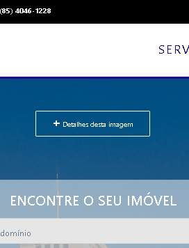
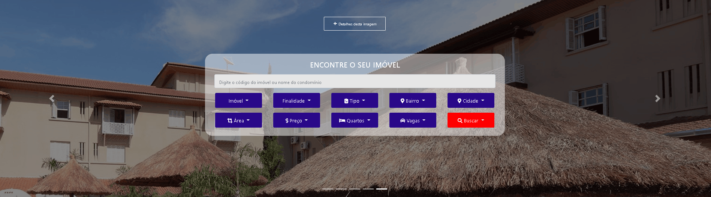
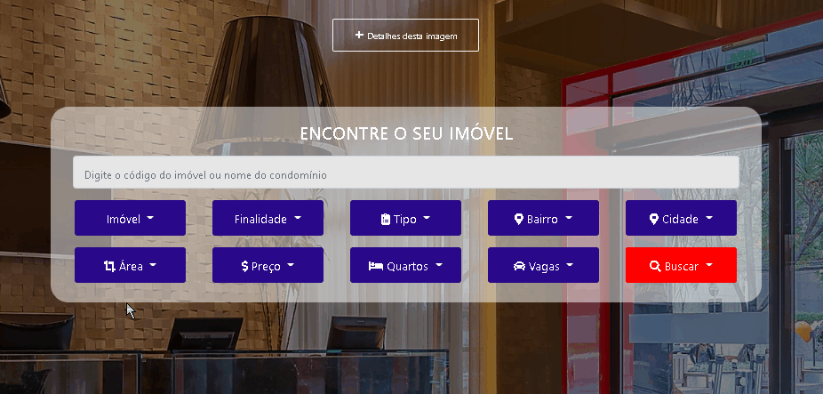

    </img>  

 

    </img>     

    <h1>Menu - Navegação</h1>
    </img>     

    <h1>Botão - Ver mais detalhes da imagem exibida</h1>
         

    <h1>Carousel</h1>
    </img>    

    <h1>Menu - Pesquisa de imóveis</h1>
    </img>    

    <h1>Mapa</h1>
    </img>    

👇 
https://obscurewillian.github.io/Riife/
